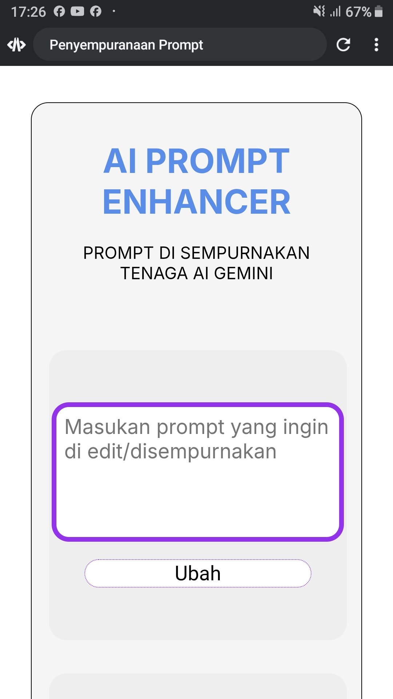
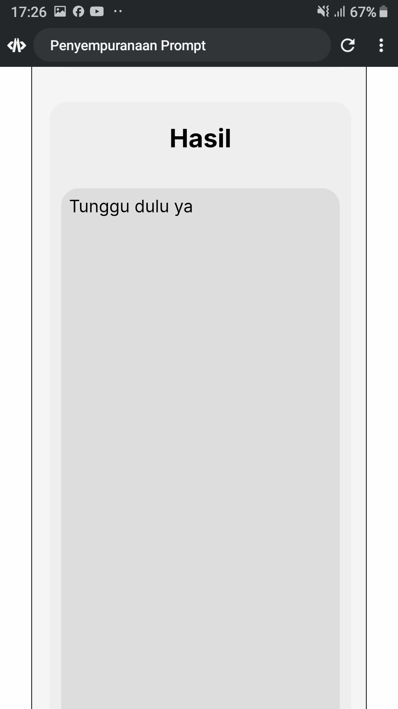

# #Day 1 Learning JavaScript
Hey guys! I have a new project to learn javascript, this is going to be endless.
I was helped by some AI


# Attention⚠️
Open the script.js file and look at this section 
```javascript
const GOOGLE_API_KEY = "YOUR_API_KEY"; 
```
Replace it with your Gemini API key, good luck!

# Hare we have screenshot for you to see

